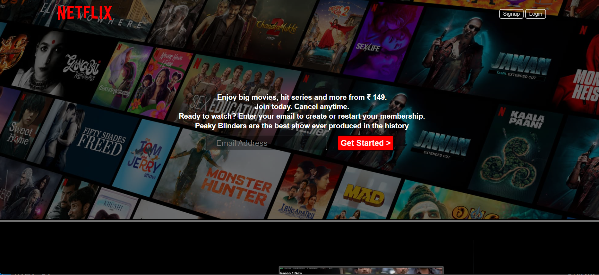

# Overview
This project is a **simplified clone of the Netflix India homepage**. It is designed to showcase the look and feel of Netflix's user interface using basic web technologies. The page includes various sections such as a hero section with a call to action, information about the service, and a FAQ section. The design is responsive and aims to give users an engaging experience similar to the official Netflix website.


## Features

 **Hero Section:** Features promotional text and an email input for starting a membership.  

 **Service Highlights:** Describes the benefits of the service, including TV compatibility, offline viewing, multiple device streaming, and children's profiles.

 **FAQ Section:** Provides answers to common questions about Netflix.

  **Footer:** Includes links to various informational and support pages.
Technologies Used
```
HTML: For structuring the webpage.
CSS: For styling the webpage.
```
Screenshot



File Structure
index.html: The main HTML file containing the structure of the webpage.
style.css: The CSS file for styling the webpage (assumed).
How to Run
Clone the Repository: Download or clone the repository to your local machine.
Open index.html: Open the index.html file in your web browser to view the webpage.